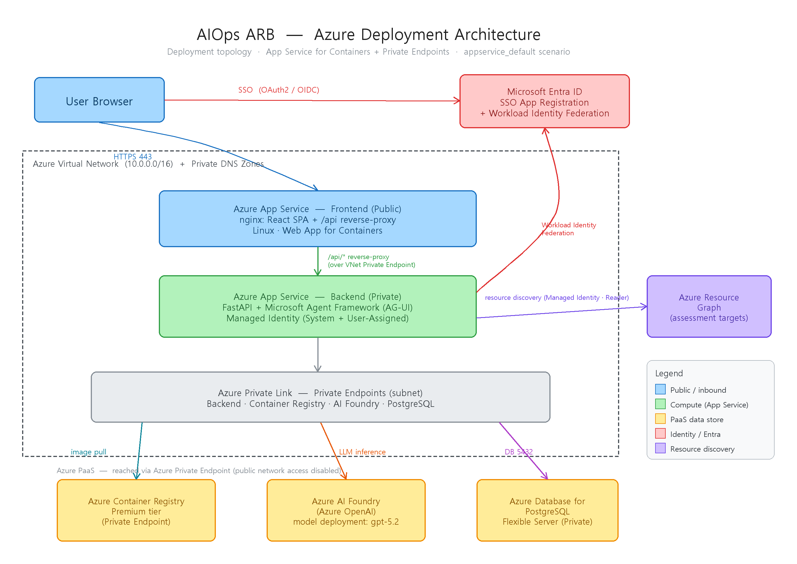

# AIOps Resource Assessment — Copilot Instructions

이 저장소는 **Azure Architecture Review Board(ARB) 체크리스트**를 기준으로 Azure 리소스를 수집·진단하고,
대화형 챗봇 + 대시보드로 평가·리포트·Terraform 개선코드까지 생성하는 풀스택 애플리케이션입니다.

> 이 문서는 GitHub Copilot / AI 에이전트가 이 저장소에서 작업할 때 참고하는 구조·규칙 요약입니다.

## 아키텍처 한눈에 보기


<details><summary>상세 뷰 (계층·모듈) · 초기 배포 토폴로지</summary>




<!-- 편집 소스: architecture.excalidraw (https://excalidraw.com 에 드래그&드롭 또는 Excalidraw VS Code 확장으로 열기) -->

</details>

핵심 흐름: **Azure 리소스 수집 → 체크리스트 진단 → 리포트(MD/JSON/HTML) → Terraform 개선코드 생성**

평가 경로는 두 갈래입니다. **v1**(`backend/agent/`, `/api/*`)은 LLM이 판정하고, **v2**(`backend/enterprise/`, `/api/v2/*`)는
관리형 원천에서 수집한 evidence로 결정론 판정합니다. v2는 `ENTERPRISE_ASSESSMENT_ENABLED` 가 켜진 경우에만 등록됩니다.

## 기술 스택

| 구분 | 내용 |
|------|------|
| 백엔드 | Python 3.11+, FastAPI, uvicorn, Microsoft Agent Framework (AG-UI) |
| LLM | Azure AI Foundry (`AzureOpenAIResponsesClient`, 배포 모델 `gpt-5.2`) |
| 인증(웹) | Microsoft Entra ID OAuth2 SSO (MSAL, UAMI 페더레이션 client_assertion) |
| 저장소 | PostgreSQL 16 (체크리스트·평가결과·Terraform) + 로컬 파일 출력 |
| 프론트엔드 | React 18, Vite 5, TypeScript, Tailwind CSS, 경량 AG-UI 스트림 클라이언트 |
| 인프라 | Terraform (App Service, ACR, AI Foundry, PostgreSQL, VNet, Private Endpoint) |
| 배포 | Docker 컨테이너 이미지 → Azure Container Registry → App Service for Containers |

## 저장소 구조

```
├── backend/                       # Python 백엔드 (uv 프로젝트)
│   ├── agent/                     # 코어 진단·저장소 모듈
│   │   ├── azure_credential.py    # LazyDefaultAzureCredential, 위임/CLI 토큰 스택
│   │   ├── azure_resource_reader.py  # Azure Resource Graph 리소스 조회
│   │   ├── subscription_scope.py  # 구독 정규화·범위 판별
│   │   ├── checklist_loader.py    # YAML/DB 체크리스트 로드
│   │   ├── assessment_engine.py   # LLM 기반 체크리스트 평가 (ComplianceStatus 등)
│   │   ├── report_generator.py    # Markdown/JSON/HTML 리포트 생성
│   │   ├── terraform_generator.py # 평가 스냅샷 → Terraform HCL 생성 (strict JSON Schema)
│   │   ├── search_query.py        # DB 조회·LLM 분석
│   │   ├── foundry_llm.py         # Foundry Responses API 래퍼 (responses_json/text)
│   │   ├── ai_foundry_config.py   # AI 엔드포인트/프로젝트 env 로딩
│   │   ├── entra_sso.py           # Entra ID OAuth2 (MSAL, UAMI 페더레이션)
│   │   ├── storage_paths.py       # 구독 스코프·레거시 경로 식별자
│   │   ├── db_init.py             # scripts/01_schema.sql 적용
│   │   └── db/                    # PostgreSQL 접근 (connection, assessment, checklist, terraform)
│   ├── chat/                      # AG-UI 챗봇
│   │   ├── agent.py               # SYSTEM_INSTRUCTIONS, create_agent(), ALL_TOOLS
│   │   └── tools/                 # 도구: assessment, search, terraform, azure_session
│   ├── enterprise/                # v2 결정론 평가 (Issue #1 §7-① 대응)
│   │   ├── domain.py              # VerdictState, EvidenceRecord(SHA-256), ControlDefinition
│   │   ├── registry.py            # control 체크리스트 + evidence source mapping YAML 로드
│   │   ├── adapters/              # arm, arg, aprl, policy, defender, advisor (aiohttp 비동기)
│   │   ├── evaluator.py           # 결정론 판정 — LLM 미개입
│   │   ├── service.py             # 수집 → 평가 → 영속화 오케스트레이션
│   │   ├── repository.py / postgres_repository.py  # InMemory / PostgreSQL 영속화
│   │   ├── coverage.py            # coverage 리포트 immutable publish/read
│   │   └── api.py                 # /api/v2 라우터 (ENTERPRISE_ASSESSMENT_ENABLED 게이트)
│   ├── tests/enterprise/          # pytest — domain·registry·evaluator·adapters·service·api·coverage
│   ├── scripts/01_schema.sql      # PostgreSQL 통합 스키마
│   ├── agui_server.py             # FastAPI 앱: auth · Azure REST · 체크리스트 · 평가 · Terraform · AG-UI
│   ├── main.py                    # 진입점: CLI 평가(-s) 또는 uvicorn 서버(기본)
│   └── pyproject.toml             # uv 의존성 (extra: chat, dev)
├── frontend/                      # React + Vite SPA (nginx 컨테이너로 서빙)
│   └── src/
│       ├── App.tsx                # 라우팅: dashboard/assessments/checklists/terraform + ChatSidebar
│       ├── components/            # 보드·패널·모달 (Dashboard, Assessment, Checklist, Terraform 등)
│       ├── context/               # AzureSession / AssessmentRun / TerraformRun Provider
│       ├── hooks/useAgUiChat.ts   # AG-UI 스트림 채팅 훅
│       └── lib/                   # authRest, ag-ui-client, azureIds, 헤더 유틸 등
├── terraform/                     # Azure 인프라 IaC
│   ├── main.tf / providers.tf / variables.tf / outputs.tf / terraform.tfvars
│   └── modules/                   # network, acr, ai_foundry, app_service, database,
│                                  # private_endpoints, appgw, firewall
├── experiments/coverage_spike/    # Storage control 스파이크 (checklists · mappings · fixtures · reports)
├── docs/superpowers/              # 프로덕션 재설계 스펙·플랜
├── docker/                        # Dockerfile.backend(.local), Dockerfile.frontend, nginx.conf.template
└── README.md
```

## 실행/빌드 명령 (모든 Python 명령은 `backend/`에서)

```bash
# 백엔드 의존성 (채팅/AG-UI 포함)
cd backend && uv sync --extra chat

# AG-UI 서버 실행 (기본 포트 5100) — Swagger: http://localhost:5100/docs
cd backend && uv run python main.py

# CLI 일회성 평가 (구독 ID 주면 서버 대신 CLI 모드)
cd backend && uv run python main.py -s <SUBSCRIPTION_ID> [-g <RG>] [-o all]

# 테스트 (enterprise 결정론 평가)
cd backend && uv run pytest tests/enterprise -q

# coverage spike gate (저장소 루트)
uv run --project backend python backend/scripts/run_coverage_spike.py

# 프론트엔드
cd frontend && npm install && npm run build   # (dev: npm run dev)

# 컨테이너 이미지 빌드 (저장소 루트 기준)
docker build -f docker/Dockerfile.backend  -t <acr>.azurecr.io/aiops-be:latest .
docker build -f docker/Dockerfile.frontend -t <acr>.azurecr.io/aiops-fe:latest .
```

## 백엔드 REST API 요약 (`/api`)

| 영역 | 주요 엔드포인트 |
|------|----------------|
| 인증 | `GET /api/auth/login` (→Entra 302), `GET /api/getAToken` (콜백), `POST /api/auth/logout`, `GET /api/auth/session` |
| Azure 세션 | `GET /api/azure/subscriptions` (OBO∩UAMI 교집합), `GET /api/azure/session-bootstrap`, `GET /api/azure/resources` |
| 대시보드 | `GET /api/dashboard/stats` (DB 집계 · subscriptions 필드는 "평가결과 있는 구독"만) |
| 평가 (v1) | `POST /api/assessments/run`, `GET /api/assessments`, `GET /api/assessments/{path}` |
| 평가 (v2) | `GET /api/v2/controls`, `POST /api/v2/assessments`, `GET /api/v2/assessments/{run_id}`, `GET /api/v2/findings/{finding_id}` |
| 체크리스트 | `GET/POST /api/checklists`, `…/upload`(YAML), `GET/PUT/DELETE /api/checklists/{name}`, `…/raw` |
| Terraform | `GET /api/terraform`, `POST /api/terraform/generate`, `GET /api/terraform/{sub}/{ts}/{file}[/raw]`, `GET /api/downloads/...` |
| 채팅 | Agent Framework: `POST /api/chat` (AG-UI) |

## 아키텍처·구현 규칙 (중요)

- **인증 분리**: 웹은 사용자 위임 토큰(OBO, ARM 쿠키/Bearer)을 `UserOboCredential`로 사용. CLI는 `az login`.
  **Foundry LLM 호출은 항상 백엔드 자격증명(`DefaultAzureCredential` = SAMI/UAMI)** 로 수행.
  미들웨어 `DelegatedUserTokenMiddleware`가 경로별로 위임/기본 자격증명을 전환.
- **구독 스코프**: UI에서 테넌트+구독 선택 → `X-Azure-Tenant-Id` / `X-Azure-Subscription-Id` 헤더로 전달 →
  `chat/tools/azure_session.py`가 도구 컨텍스트에 반영. 평가는 이 스코프에서 Resource Graph로 조회.
- **평가 실행 전제**: `run_assessment`는 유효한 `checklist_id`(문자열) 또는 `checklist_ids`(배열)가 있어야 실행됨.
  없으면 카탈로그만 반환. 체크리스트는 **DB에 등록된 YAML**에서 로드됨(레포에 YAML 원본은 두지 않음).
- **대시보드 "구독 ID" 드롭다운**은 실시간 구독 목록이 아니라 **DB에 평가결과가 있는 구독**만 표시 → 신규 배포 시 비어 있음(정상).
- **체크리스트 YAML 스키마**: `metadata`(name/version/description/applicable_resource_types) →
  `categories[].items[].checks[]`, 각 check는 `question` + `azure_check`(type: automated|manual, guidance 등).
  `applicable_resource_types`가 비면 모든 리소스 타입에 적용되는 범용 체크리스트.
- **Terraform 생성**: strict JSON Schema로 provider/variables/main/outputs 4개 HCL 필드를 받음
  (`terraform_generator.py`의 `TERRAFORM_RESPONSE_JSON_SCHEMA`, 파일 순서 고정).
- **DB 모드 전환**: `DB_HOST`가 설정되면 DB 모드, 비면 파일 기반. 스키마는 기동 시 `db_init`이 적용.
- **v2 결정론 평가 제약**(`backend/enterprise/`): 판정은 `evaluator.py`만 생성하며 **LLM은 verdict를 바꿀 수 없음**.
  증거 결손·부분·충돌·스로틀링·권한부족은 `fail`이 아니라 **`unknown`**. verdict는 6상태로 고정
  (`pass`/`fail`/`unknown`/`not_applicable`/`exempted`/`manual_pending`). 모든 evidence는 source kind/reference/version·
  관찰 시각·SHA-256 content hash를 보유. 신규 Python 동작은 TDD(실패 테스트 → 최소 구현 → 재실행)로 추가.
- **v2에서 LLM의 역할**: 근거 설명·후속 조사·`agent_assisted` 항목·remediation 초안에만 사용.
  control은 `evaluator_kind`(`managed`/`custom`/`agent_assisted`/`manual`)로 판정 방식을 명시하고,
  evidence source는 API 버전 또는 `query-sha256`로 고정해 재현성을 보장한다.
- **롤백 경로 보존**: `/api/v2`는 `ENTERPRISE_ASSESSMENT_ENABLED`가 켜진 경우에만 라우터를 등록. 기존 `/api` 동작과
  테이블은 그대로 유지할 것.

## 배포 관련 주의 (거버넌스가 엄격한 구독)

- 이 앱의 Terraform은 기본적으로 **App Service·ACR·AI·PostgreSQL을 Private Endpoint 전용**으로 배포.
  App Service가 사설 ACR에서 이미지를 pull하려면 **`WEBSITE_PULL_IMAGE_OVER_VNET=true`** + ACR `publicNetworkAccess=Disabled`(PE 전용) 조합이 필요.
- **Key Vault 공용 접근이 정책으로 강제 Disabled인 구독**에서는 로컬 `terraform apply`가 KV 시크릿을 읽지 못함.
  이 경우 database·app_service 모듈이 KV 대신 **직접 변수/앱 설정**으로 자격증명을 받도록 구성되어 있음
  (민감값은 gitignore된 `terraform/*.auto.tfvars`에 분리).
- `frontend_exposure_mode`로 프론트 노출 토폴로지 분기: `appgw` | `appservice_managed_cert` | `appservice_default`(기본, azurewebsites.net).

## 코딩 컨벤션

- 코드 주석·문서는 한국어, 기술 용어·식별자·리소스 이름은 영어 그대로 유지.
- 챗봇 응답은 한국어로, 60% 미만 점수 리소스 강조, 심각도(high>medium>low) 순 정렬 (`chat/agent.py` 참고).
- 비밀값은 커밋 금지: `.env`, `*.pfx/.p12`, `*.tfstate`, `*.auto.tfvars`는 `.gitignore` 처리됨.

## Issue #1 기반 업데이트

[Issue #1 — 설계·기능 원점 정리](https://github.com/daeungo1/poc-aiops-arb/issues/1) 기준. Ⅰ부 §7은 논의 지점, Ⅱ부 §11은 build vs adopt 방향.

| 논의 지점 (Ⅰ부 §7) | 상태 |
|---|---|
| ① 판정 신뢰성 — 결정론 evaluator | ✅ `backend/enterprise/` + `/api/v2` |
| ② 체크리스트 corpus 원천 매핑 | 🟡 Storage control 스파이크 범위 |
| ③ Terraform 산출물 검증(validate·scan) | ⬜ `remediation_*` 스키마만 선반영 |
| ④ 챗봇 evidence 조회·해석 도구 | ⬜ 미구현 (현재는 v1 런처) |
| ⑤ 정확도 측정 기준 | 🟡 coverage gate + `backend/tests/enterprise/` |

Ⅱ부 §11 방향 — ADOPT: 판정 corpus(APRL·Advisor·Defender·Policy) · Agent 런타임(Foundry) · 인증(Easy Auth) · Eval /
BUILD: 판정 실행(registry + 6상태) · Evidence(provenance) · **Terraform 검증 루프(핵심 IP, finding 단위·자동 적용 금지)**.
현재 브랜치는 BUILD 중 판정 실행·Evidence까지 반영. §14의 registry 저작·유지 방식(A~D)은 **결정 보류**이며,
어느 안이든 registry 버전 관리 + 자동 회귀(coverage/verdict diff) + 사람 확정 단계는 필수.

상세 플랜: [docs/superpowers/plans/2026-08-02-production-redesign.md](../docs/superpowers/plans/2026-08-02-production-redesign.md)
