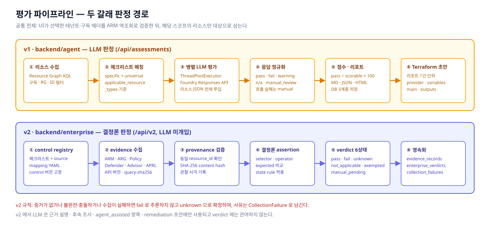
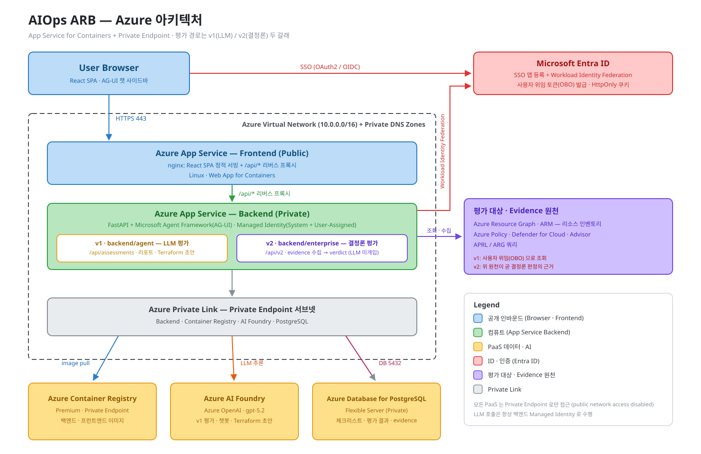
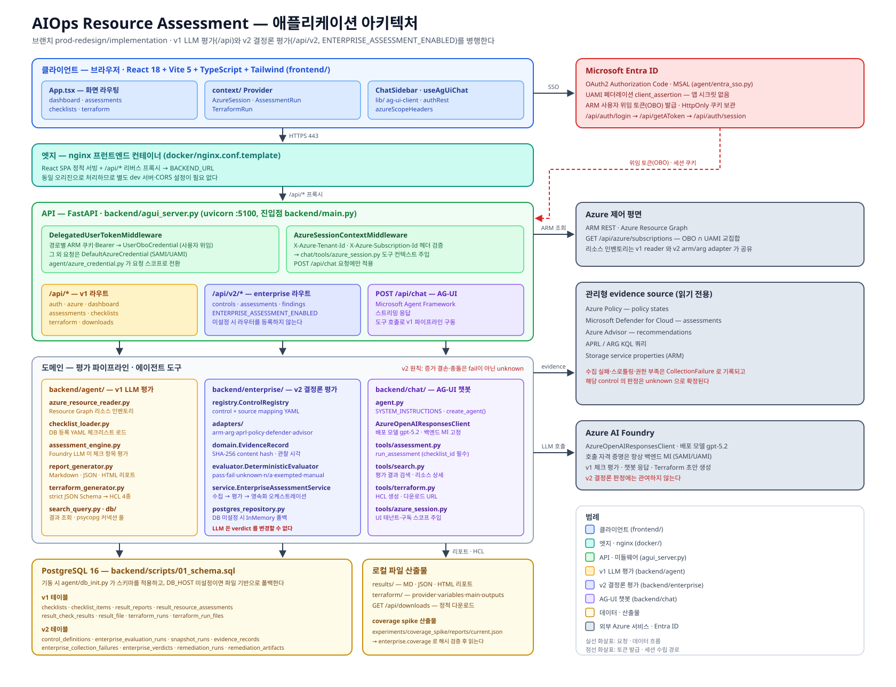

# AIOps - ARB

Azure Architecture Review Board(ARB) 체크리스트를 기준으로 Azure 리소스를 수집·진단하고, Microsoft Agent Framework(AG-UI)와 React(Vite) UI로 대화형 평가·대시보드를 제공하는 프로젝트입니다.

> 기준 문서: [Issue #1 — 설계·기능 원점 정리](https://github.com/daeungo1/poc-aiops-arb/issues/1)
> 현재 브랜치: `prod-redesign/implementation` — Ⅰ부 §7의 **판정 신뢰성**과 Ⅱ부 §11의 **BUILD 항목(판정 실행·Evidence)** 을 구현한 상태입니다.

---

## 1. 프로젝트 목적 및 구성

### 1.1 목적

엔지니어가 자기 구독을 선택하면 조직의 ARB 체크리스트 기준으로 배포된 리소스를 진단하고, 점수화된 리포트·대시보드를 확인하고, 위반 사항을 해결하는 Terraform 초안까지 받아가는 **사내 ARB 평가 포털**입니다. 사람이 반복하던 아키텍처 리뷰의 반복 구간을 자동화하는 것이 목표입니다.

```text
구독 선택 → 리소스 동기화 → 체크리스트 선택 → 평가 실행
→ 점수 · 리포트 · 대시보드 → (선택) 위반 해결 Terraform 생성 → 다운로드
```

**UI 버튼과 챗봇은 같은 기능의 이중 진입점입니다.** 평가 실행과 Terraform 생성은 보드 버튼으로도, 챗 대화로도 수행할 수 있고 완료 신호는 커스텀 이벤트(`CHAT_REFRESH_*`)로 양쪽 화면에 전파됩니다.

### 1.2 저장소 구성

| 디렉터리 | 역할 |
|---|---|
| `backend/agent/` | **v1** — 리소스 수집 · 체크리스트 로드 · LLM 평가 · 리포트 · Terraform 생성 · DB 접근 |
| `backend/enterprise/` | **v2** — control registry · evidence 어댑터 · 결정론 evaluator · 영속화 · `/api/v2` |
| `backend/chat/` | AG-UI 챗봇 에이전트와 도구 9종 |
| `backend/tests/enterprise/` | v2 결정론 평가 테스트 (269개) |
| `frontend/src/` | React SPA — 4개 보드 + 챗 사이드바 |
| `terraform/` | 이 앱 자체를 Azure에 배포하는 IaC (PE 전용 구성) |
| `experiments/coverage_spike/` | Storage control 매핑 실험 — 체크리스트·매핑·fixture·coverage 리포트 |
| `docs/superpowers/` | 프로덕션 재설계 스펙·플랜 |

### 1.3 기술 스택

| 구분 | 내용 |
|------|------|
| 백엔드 | Python 3.11+, FastAPI, uvicorn, Microsoft Agent Framework(AG-UI), aiohttp |
| LLM | Azure AI Foundry (`AzureOpenAIResponsesClient`, 배포 모델 `gpt-5.2`) — 호출 자격 증명은 항상 백엔드 MI |
| 인증(웹) | Entra ID OAuth2 · MSAL · UAMI 페더레이션 `client_assertion` (`agent/entra_sso.py`) |
| 저장소 | PostgreSQL 16 + 로컬 파일 출력(폴백) |
| 프론트엔드 | React 18, Vite 5, TypeScript, Tailwind CSS, 경량 AG-UI 스트림 클라이언트 |
| 인프라·배포 | Terraform (App Service · ACR · AI Foundry · PostgreSQL · VNet · Private Endpoint) → Docker → ACR → App Service for Containers |

### 1.4 빠른 시작

```bash
# 백엔드 의존성 (채팅/AG-UI 포함) · 개발 도구
cd backend && uv sync --extra chat
cd backend && uv sync --extra dev

# 서버 실행 (기본 5100) — Swagger: http://localhost:5100/docs
cd backend && uv run python main.py

# CLI 일회성 평가 (구독 ID를 주면 서버 대신 CLI 모드)
cd backend && uv run python main.py -s <SUBSCRIPTION_ID> [-g <RG>] [-o all]

# 프론트엔드
cd frontend && npm install && npm run build

# 컨테이너 이미지 빌드 (저장소 루트)
docker build -f docker/Dockerfile.backend  -t <acr>.azurecr.io/aiops-be:latest .
docker build -f docker/Dockerfile.frontend -t <acr>.azurecr.io/aiops-fe:latest .

# 테스트 · coverage gate
cd backend; uv run pytest tests/enterprise -q
uv run --project backend python backend/scripts/run_coverage_spike.py
```

`.env.template`을 복사해 `.env`를 만들고 다음을 채웁니다.

| 변수 | 설명 |
|------|------|
| `AZURE_AUTH_CLIENT_ID` / `AZURE_AUTH_TENANT_ID` / `AZURE_AUTH_REDIRECT_URI` | 웹 Entra SSO |
| `AZURE_AUTH_STATE_SECRET` | OAuth `state` HMAC용 앱 로컬 비밀(Entra 미등록, 16자 이상 권장) |
| `AZURE_AUTH_CLIENT_SECRET` **또는** `AZURE_AUTH_SSO_UAMI_CLIENT_ID` | 로컬은 client secret, 배포는 UAMI 페더레이션 |
| `AZURE_AI_ENDPOINT` / `AZURE_AI_PROJECT_NAME` / `AZURE_AI_MODEL_DEPLOYMENT_NAME` | Azure AI Foundry 엔드포인트 · 프로젝트 · 배포 모델 |
| `DB_HOST` / `DB_PORT` / `DB_NAME` / `DB_USER` / `DB_PASSWORD` | PostgreSQL. `DB_HOST`가 비면 파일 기반 폴백 |
| `AZURE_RESOURCE_READER_UAMI_CLIENT_ID` | 구독 교집합 · Resource Graph 조회용 UAMI |
| `ENTERPRISE_ASSESSMENT_ENABLED` | `true`일 때만 v2 결정론 평가 라우터(`/api/v2`) 등록 |

---

## 2. 사용자 경험 (프론트엔드)

React SPA + 우측 챗 사이드바. 4개 보드 + 로그인으로 구성됩니다.

| 화면 | 기능 |
|------|------|
| **로그인** | Entra ID SSO → HttpOnly 쿠키 세션. 로그인 후 구독 선택 드로어(사용자 OBO 접근 구독 ∩ 백엔드 MI Reader 구독의 **교집합만** 노출) |
| **대시보드** | 기간·RG·타입 필터 기반 종합 통계 — KPI, 점수 추이, 점수 분포, 하위 리소스, 자동/수동 비율, pass/fail 비율. 차트 클릭 → 리소스 목록 팝업 → 리소스 클릭 → 체크 상세 팝업(drill-down) |
| **평가** (3탭) | ① 차트: 구독·리소스별 시각화 ② **진단평가**: 클라우드 동기화 → RG/리소스 체크박스 선택 → 체크리스트 선택 → 평가 실행(진행 상태 표시) ③ **평가결과**: 리포트 파일 트리(MD/JSON/HTML) → 뷰어 → 다운로드 → **테라폼 생성** 버튼 |
| **체크리스트** | YAML 업로드 · 목록 · 상세(카테고리→항목→질문 트리, 자동/수동 배지) · 편집 · 다운로드 · 삭제 |
| **Terraform** | 생성 이력(구독·타임스탬프 단위) → 파일별 HCL 뷰어 → 다운로드 |
| **챗 사이드바** | AG-UI 스트리밍. 도구 실행 상태 표시, 평가·Terraform 완료 시 해당 보드 자동 갱신 |

**대시보드 구독 드롭다운**은 실시간 구독 목록이 아니라 **DB에 평가 결과가 있는 구독**만 표시합니다(신규 배포 직후 비어 있는 것이 정상).

---

## 3. 기능 상세 (백엔드)

### 3.1 두 갈래 평가 경로

프로덕션 전환 과정에서 **판정 신뢰성**을 확보하기 위해 결정론 평가 경로를 추가했습니다. 기존 경로는 그대로 유지되며 두 경로는 동시에 존재합니다.



| | **v1 — LLM 평가** (기본) | **v2 — 결정론 평가** (`ENTERPRISE_ASSESSMENT_ENABLED`) |
|---|---|---|
| 코드 | `backend/agent/` | `backend/enterprise/` |
| 라우트 | `/api/assessments/*` | `/api/v2/*` |
| 판정 주체 | Azure AI Foundry LLM | `evaluator.DeterministicEvaluator` (LLM은 verdict 변경 불가) |
| 증거 | 리소스 JSON을 프롬프트로 전달 | ARM · ARG · Policy · Defender · Advisor · APRL 어댑터가 수집, 레코드마다 source kind/reference/version · 관찰 시각 · SHA-256 content hash 저장 |
| 결과 상태 | `pass` / `fail` / `warning` / `n/a` / `manual_review` | `pass` / `fail` / `unknown` / `not_applicable` / `exempted` / `manual_pending` |
| 증거 결손 시 | LLM 추론에 의존 | `fail`이 아니라 **`unknown`**, 사유는 `CollectionFailure`로 기록 |
| 산출물 | MD·JSON·HTML 리포트 + Terraform 초안 | control별 verdict + evidence 추적(감사 가능) |

v2에서 LLM은 **근거 설명 · 후속 조사 · 관리형 원천으로 매핑할 수 없는 `agent_assisted` 항목 · remediation 초안**에만 쓰입니다. control은 `evaluator_kind`(`managed` · `custom` · `agent_assisted` · `manual`)로 판정 방식을 명시하고, coverage 리포트가 이 분포를 기계 판정 비율로 집계합니다.

`ENTERPRISE_ASSESSMENT_ENABLED`가 꺼져 있으면 `/api/v2` 라우터를 등록하지 않으므로 기존 `/api` 동작은 영향을 받지 않습니다(롤백 경로 보존).

### 3.2 인증·스코프 (이중 자격 증명)

리소스 조회는 **사용자 권한**으로, LLM 호출은 **백엔드 신원**으로 수행합니다.

- `DelegatedUserTokenMiddleware` — `/api/chat`, `/api/azure/*`, `/api/assessments*`, `/api/terraform*`, `/api/downloads*`, `/api/v2*` 경로에만 ARM 쿠키·Bearer를 `UserOboCredential`로 주입하고, 그 외에는 `DefaultAzureCredential`(SAMI/UAMI)을 사용합니다.
- `AzureSessionContextMiddleware` — UI가 보낸 `X-Azure-Tenant-Id` / `X-Azure-Subscription-Id`를 ARM 역조회로 검증한 뒤 도구 컨텍스트에 주입합니다.
- 구독 목록은 **사용자 OBO 접근 구독 ∩ 백엔드 MI Reader 구독**의 교집합만 노출합니다.

### 3.3 체크리스트

YAML 1파일 = 체크리스트 1개이며, 등록하면 `upsert_from_yaml_content()` 가 원문(`raw_yaml`)을 `checklists` 에,
3단 계층 평탄화 결과를 `checklist_items` 에 저장합니다. **런타임 조회는 항상 DB 기준**입니다.

```yaml
metadata:            # name · version · description · applicable_resource_types
categories:
  - id: <필수>
    name: <필수>
    items:
      - id: <필수>
        name: <필수>
        checks:
          - question: <필수>
            priority: HIGH | MEDIUM | LOW
            azure_check:  # type(manual|automated) · check_method · resource_type
                          # condition.field/equals · expected · policy_effect · guidance
```

- `applicable_resource_types`가 비면 모든 타입에 적용되는 **universal**, 값이 있으면 case-insensitive substring 매칭으로 **specific** 체크리스트가 됩니다.
- 등록 경로는 세 가지입니다 — 체크리스트 화면 업로드, `POST /api/checklists/upload`, 그리고 **대량 시드 스크립트**.
- v2는 여기에 더해 control ↔ 관리형 원천 매핑 YAML을 사용하며(`experiments/coverage_spike/mappings/`), 각 원천은 API 버전 또는 `query-sha256`으로 고정해 재현성을 보장합니다.

**시드 코퍼스** (`backend/seeds/checklists/`) — Microsoft Cloud Security Benchmark · Well-Architected Framework 기준의 샘플 5종(검사 59개: 자동 47 / 수동 12).

| 파일 | 적용 타입 |
|---|---|
| `azure_storage_account.yaml` | `Microsoft.Storage/storageAccounts` |
| `azure_app_service.yaml` | `Microsoft.Web/sites` |
| `azure_postgresql_flexible.yaml` | `Microsoft.DBforPostgreSQL/flexibleServers` |
| `azure_key_vault.yaml` | `Microsoft.KeyVault/vaults` |
| `azure_common_governance.yaml` | (비움 — universal) |

```bash
# 로컬 DB 직접 등록 / 검증만 / 배포 인스턴스에 HTTP 등록
cd backend && uv run python scripts/seed_checklists.py
cd backend && uv run python scripts/seed_checklists.py --dry-run
cd backend && uv run python scripts/seed_checklists.py --api-base https://<host>
```

스크립트는 디렉터리를 재귀 탐색해 파일단위로 검증·등록하고, 한 파일이 실패해도 나머지를 계속 처리한 뒤 요약과 종료 코드로 보고합니다(수백 건 등록 전제). 동일한 파일명으로 다시 실행하면 upsert 됩니다.

### 3.4 챗봇 도구 (9종)

| 파일 | 도구 |
|------|------|
| `tools/assessment.py` | `get_subscription_info` · `list_azure_resources` · `list_checklists` · `get_checklist_detail` · `run_assessment` |
| `tools/search.py` | `get_latest_assessments` · `search_assessments` · `get_resource_detail` |
| `tools/terraform.py` | `generate_terraform_code` (코드 붙여넣기 대신 다운로드 링크 반환) |
| `tools/azure_session.py` | UI가 보낸 테넌트·구독 스코프를 도구 컨텍스트에 주입 |

`run_assessment`는 유효한 `checklist_id`/`checklist_ids`가 있어야 실행되며 없으면 카탈로그만 반환합니다. 스레드 상태에 마지막 `report_id`를 저장해 "방금 결과로 Terraform 생성" 흐름을 지원합니다. 응답은 한국어로, 60% 미만 점수 리소스를 강조하고 심각도(high>medium>low) 순으로 정렬합니다.

### 3.5 REST API 요약

| 영역 | 주요 엔드포인트 |
|------|----------------|
| 인증 | `GET /api/auth/login` (→ Entra 302), `GET /api/getAToken` (콜백·쿠키 설정 후 `/` 302), `POST /api/auth/logout`, `GET /api/auth/session` |
| Azure 세션 | `GET /api/azure/subscriptions` (OBO ∩ UAMI 교집합), `GET /api/azure/session-bootstrap`, `GET /api/azure/resources` |
| 대시보드 | `GET /api/dashboard/stats` · `/kpi` · `/trend-detail` · `/score-range-resources` |
| 평가 (v1) | `POST /api/assessments/run`, `GET /api/assessments`, `GET /api/assessments/{path}`, `GET /api/assessments/charts-summary` · `/resource-check-results` |
| 평가 (v2) | `GET /api/v2/controls`, `POST /api/v2/assessments`, `GET /api/v2/assessments/{run_id}`, `GET /api/v2/findings/{finding_id}` |
| 체크리스트 | `GET /api/checklists`, `POST /api/checklists/upload`, `GET/PUT/DELETE /api/checklists/{name}`, `GET /api/checklists/{name}/raw` |
| Terraform | `GET /api/terraform`, `POST /api/terraform/generate`, `DELETE /api/terraform/{sub}/{ts}`, `GET /api/terraform/{sub}/{ts}/{file}[/raw]` |
| 다운로드 | `GET /api/downloads/...` (생성된 HCL 정적 서빙) |
| 채팅 | `POST /api/chat` (AG-UI · Microsoft Agent Framework) |

---

## 4. 데이터 구성 (PostgreSQL)

기동 시 `agent/db_init.py`가 `backend/scripts/01_schema.sql`을 적용합니다. `DB_HOST`가 비면 로컬 `results/{subscription}/` 파일 기반으로 폴백합니다.

| 그룹 | 테이블 | 비고 |
|------|--------|------|
| 체크리스트 | `checklists` → `checklist_items` | raw_yaml 원문 보관 + categories→items→checks 평탄화 |
| v1 평가 결과 | `result_reports` → `result_resource_assessments` → `result_check_results` + `result_file` | 실행 → 리소스 → 검사 3계층 granularity |
| Terraform | `terraform_runs` → `terraform_run_files` | `source_report_ids`로 원본 리포트 추적 |
| v2 결정론 평가 | `control_definitions` · `enterprise_evaluation_runs` · `snapshot_runs` · `evidence_records` · `enterprise_collection_failures` · `enterprise_verdicts` | control 버전 고정 + evidence provenance |
| 개선 실행 | `remediation_runs` · `remediation_artifacts` | Terraform 검증 루프용 스키마 (구현 예정) |

- v1 점수 = `n/a`·`manual_review`를 제외한 scorable 항목 중 pass 비율 × 100
- v2 evidence 레코드 = source kind · reference · version · 관찰 시각 · SHA-256 content hash
- coverage spike 산출물의 canonical 진입점은 `experiments/coverage_spike/reports/current.json` 하나이며, `enterprise.coverage.read_current_report_bundle()`로 해시를 검증한 뒤 읽습니다.

---

## 5. 시스템 아키텍처

### 5.1 한눈에 보기 — Azure 리소스 매핑



| 구성 | 내용 |
|------|------|
| 프런트엔드 | App Service (Public) — nginx가 SPA 서빙 + `/api/*` 리버스 프록시 |
| 백엔드 | App Service (Private) — FastAPI + Agent Framework, Managed Identity, v1/v2 두 평가 경로 |
| 네트워크 | VNet + Private DNS Zone, Private Endpoint 서브넷 |
| PaaS | Container Registry(이미지) · AI Foundry(LLM) · Database for PostgreSQL — **모두 Private Endpoint 전용** |
| ID | Entra ID — SSO + Workload Identity Federation + OBO 토큰 발급 |
| 평가 대상 | Resource Graph · ARM · Policy · Defender · Advisor · APRL |

### 5.2 상세 뷰 — 계층·모듈

<details><summary>펼치기</summary>



| 계층 | 구성 |
|------|------|
| 클라이언트 | `App.tsx` 라우팅 · Context Provider · ChatSidebar |
| 엣지 | nginx — SPA 정적 서빙 + `/api/*` 프록시(동일 오리진) |
| API | FastAPI — 위임 토큰 미들웨어 · Azure 세션 미들웨어 · `/api` · `/api/v2` · `/api/chat` |
| 도메인 | `agent/`(v1) · `enterprise/`(v2) · `chat/`(도구) |
| 데이터 | PostgreSQL 16 + 로컬 산출물 |
| 외부 | Entra ID · ARM/ARG · 관리형 evidence 원천 · AI Foundry |

</details>

초기 배포 토폴로지 원본은 [.github/architecture.png](.github/architecture.png)에 남아 있습니다.

---

## 6. main 대비 변경된 점

`origin/main`과 비교해 **61개 파일 · +15,744 / −94 줄**이 변경되었습니다. 기존 v1 코드는 거의 손대지 않고 v2 경로를 병렬로 추가한 구조입니다.

### 신규 추가

| 영역 | 내용 |
|------|------|
| `backend/enterprise/` | 결정론 평가 패키지 — `domain` · `registry` · `adapters/`(6종) · `evaluator` · `service` · `repository`/`postgres_repository` · `coverage` · `api` |
| `backend/tests/enterprise/` | 테스트 269개 (domain · registry · evaluator · adapters · service · repository · api · coverage) |
| `experiments/coverage_spike/` | Storage control 매핑 실험 — 체크리스트·매핑 YAML, fixture, expected, coverage 리포트(immutable generation + `current.json`) |
| `docs/superpowers/` | 재설계 설계 스펙과 실행 플랜 |
| `.github/*.svg` | 아키텍처(한눈에 보기 / 상세) · 평가 파이프라인 도식 |

### 기존 파일 변경

| 파일 | 변경 |
|------|------|
| `backend/scripts/01_schema.sql` | v2 테이블 8종 추가 (`control_definitions` · `snapshot_runs` · `evidence_records` · `enterprise_verdicts` · `enterprise_collection_failures` · `enterprise_evaluation_runs` · `remediation_runs` · `remediation_artifacts`) |
| `backend/agui_server.py` | enterprise registry/repository/transport 싱글턴 + `/api/v2` 라우터 등록(feature flag) |
| `backend/agent/azure_credential.py` | `/api/v2` 경로를 사용자 위임 토큰 대상에 추가 |
| `backend/agent/__init__.py` | lazy import로 전환 — 체크리스트 로더만 쓸 때 LLM·Agent Framework 모듈을 끌어오지 않음 |
| `backend/pyproject.toml` | `aiohttp`(비동기 evidence 수집), `filelock`(coverage 리포트 발행 락) 추가 |
| `.env.template` | `ENTERPRISE_ASSESSMENT_ENABLED` 스위치 문서화 |
| `README.md` · `.github/copilot-instructions.md` | 구조·API·평가 경로 현행화 |

### 동작상 달라지는 점

- `ENTERPRISE_ASSESSMENT_ENABLED`를 켜지 않으면 **런타임 동작은 main과 동일**합니다(`/api/v2` 미등록).
- 켜면 `/api/v2`에서 결정론 평가를 실행할 수 있고, v1 경로와 테이블은 그대로 유지됩니다.

---

## 7. 추가 논의 필요 사항

### 7.1 Issue #1 Ⅰ부 §7 — 방향 논의 지점

| 논의 지점 | 현재 상태 |
|-----------|-----------|
| ① 판정 신뢰성 — 결정론 evaluator, evidence 실측 대조 | ✅ `backend/enterprise/` + `/api/v2` 구현 |
| ② 체크리스트 corpus — 관리형 원천과의 관계 정립 | 🟡 source mapping 계약 확정, 현재 Storage control 스파이크 범위 |
| ③ Terraform 산출물 품질 — validate·scan 검증 | ⬜ `remediation_*` 스키마만 선반영 |
| ④ 챗봇 역할 — evidence 조회·해석 도구 | ⬜ 미구현 (현재 챗봇은 v1 파이프라인 런처) |
| ⑤ 평가 방법 — 정확도 측정 기준 | 🟡 합성 fixture 기반 coverage gate + 테스트 269개 |

### 7.2 Issue #1 Ⅱ부 §11 — build vs adopt 기준 현재 위치

원칙은 **Microsoft가 유지하는 것은 채택(ADOPT)하고, 차별화 지점에 집중(BUILD)** 하는 것입니다.

| 계층 | Issue 방향 | 현재 브랜치 |
|------|-----------|-------------|
| 판정 corpus | **ADOPT** — APRL · Advisor · Defender · Azure Policy | 🟡 6종 어댑터 구현, 매핑은 스파이크 범위 |
| 판정 실행 | **BUILD(소)** — ControlDefinition registry + 6상태 모델 | ✅ `registry.py` · `evaluator.py` |
| Evidence | **BUILD(소)** — snapshot + provenance | ✅ `EvidenceRecord` · `snapshot_runs` |
| Terraform 생성·검증 루프 | **BUILD(핵심 IP)** — finding 단위 생성 → fmt/validate/plan/scan → draft PR, 자동 적용 금지 | ⬜ 스키마만 선반영 |
| Agent 런타임 | **ADOPT** — Foundry hosted agent · tracing, 챗봇은 해석·근거 인용으로 재정의 | ⬜ 자체 AG-UI 배관 유지 |
| Eval | **ADOPT + BUILD(소)** — golden fixture verdict oracle, CI promotion gate | 🟡 coverage gate + 테스트 |
| 인증 | **ADOPT** — App Service Easy Auth + OBO | ⬜ 수제 MSAL · UAMI 페더레이션 유지 |
| UI | **RESPEC** — 화면·drill-down 계승, 데이터 계약 재정의 | ⬜ v1 화면 그대로 |

### 7.3 결정이 필요한 항목

1. **registry 저작·유지 방식 (§14, 결정 보류)** — 자연어 문서 canonical(A) / 구조화 canonical + 저작 지원(B) / 필드별 저작 표면 + 플라이휠(C) / agentic 해석(D) 중 택일 또는 조합.
   어느 안이든 **registry 버전 관리 + 갱신 시 자동 회귀(coverage diff · verdict diff) + 사람 확정 단계**는 필수입니다.
2. **coverage 실측 (§13-1)** — 조직 ARB 항목 중 관리형 원천으로 결정론 판정 가능한 비율. 이 값이 낮으면 `agent_assisted` 비중과 eval 투자가 함께 커집니다. 현재는 합성 Storage fixture 범위만 측정한 상태입니다.
3. **Terraform 검증 루프의 안전 경계 (§13-2)** — validate/plan/scanner를 모두 붙여도 semantic 안전은 보장되지 않으므로 human review 단계를 제품 흐름에 유지할 것.
4. **관리형 의존의 반대급부 (§13-3)** — Foundry evaluation·hosted agent 채택은 유지보수를 줄이는 대신 플랫폼 로드맵 종속을 감수하는 선택.
5. **registry 원천 경로** — 현재 `/api/v2`가 `experiments/coverage_spike/`의 산출물을 직접 참조합니다. 프로덕션 승격 시 정규 경로·배포 방식 결정 필요.

### 7.4 계승하기로 한 것 (§12)

구독 스코프 격리(OBO∩MI 교집합 + 헤더 검증), 결과 3계층 granularity, 체크리스트 계층 스키마, UI 흐름 전체, 배포 Terraform의 거버넌스 대응(PE 전용·KV 정책 우회)은 그대로 유지합니다. v1 경로도 신규 경로의 동등성이 검증될 때까지 제거하지 않습니다.

---

## 라이선스

Internal Use Only — [PROPRIETARY.md](PROPRIETARY.md)
